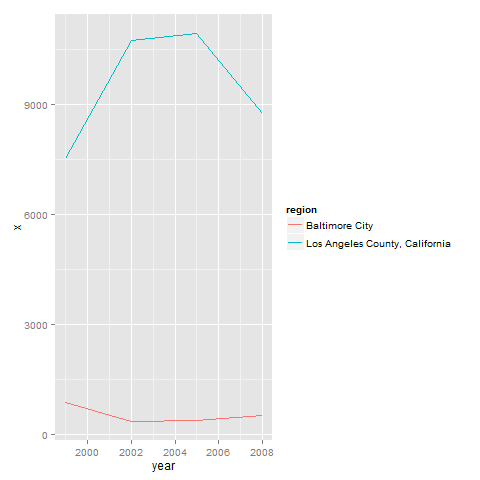

## Student Notes
The 6 R files assume the Source_Classification_Code.rds and the summarySCC_PM25 are on the R Working Directory. The 6 corresponding PNG files will be written there as well.
Requires the ggplot2 package to be installed.

### Plot 1

 

### Plot 2

 

### Plot 3

 

### Plot 4
 

### Plot 5
 

### Plot 6
 

